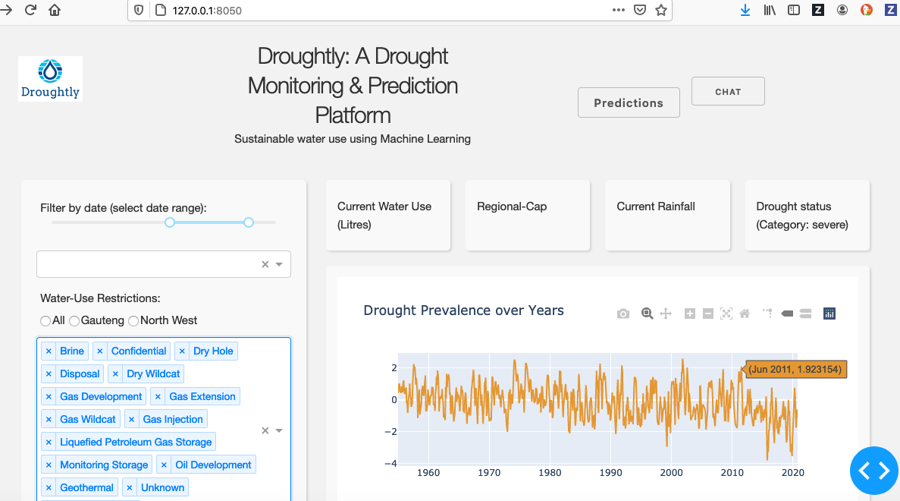

# Droughtly: A Dashboard for Visualizing, Monitoring and Predicting Drought 

Our response to the call for code University spot challenge: students vs climate change!

This is a drought monitoring and prediction platform built using Dash - interactive Python framework developed by [Plotly](https://plot.ly/). Our solution seeks to augment efforts to improve water sustainability by providing timely and accurate hydrological information to water managers and regulators. Besides displaying key hydrological information, the solution also leverages machine learning technologies such as Artificial Neural Networks to forecast trends in drought prevelance. Last but not least, we also use IBM Watson developed chatbot to facilitate the explanation of key features of the data, as well as important hydrological concepts related to drought, water and climate change. 

Climate change, over-abstraction and pollution are affecting the sustainable use of valuable water resources accross the world. None is more true during times of drought. The impacts of drought, brought about by climate change, can have severe consquences on a regions water supply, food supply and energy supply. Affecting the very livelihoods of people experiencing drought. Water resource managers, regulators and service providers are especially challenged during times of drought, when trying to ensure a sustainable supply of water. Their efforts are often curtailed by the lack of timely key hydrological information needed to better manage water resources. In addition, often specialist skills and experience is needed to navigate and utitilize the vast wealth of water related data generated through remote sensing, modelling and ground activities. Furthermore, the current decentralized nature of relevant data and the platforms used to access the data increases the complexity for current users. Providing critical water related information, in a user friendly and centralized manner will empower water managers, and other stakeholders to make more informed decisions to support sustainable water management. 

To this end, our solution focuses on leveraging the large volumes of water related data, by transforming the data into useful information. Droughtly provides a view to regions water resources, both in terms of surface water and groundwater. The interactive nature of the dashboard allows the various datasets to be explored in conjuctively, which should facilitate a better understanding of the terrestial water system, and its impacts on the water supply infrastructure, such as dams. In addition, by incorporating pre-emptive forecasting of future trends in drought indicators, we move from mitigation to risk reduction. This powerful feature will allow authorities to better plan ahead, to ensure long-term sustainability. Finally, in an effort to educate stakeholders on the information displayed as well as simple concepts in climate change and drought, a chatbot is implemented in the chatbot. The chatbot allows simple questions to be asked regarding the information displayed as well as the relation to drought and climate change.         

## Key features

- Interactive data vizualization
- Display of key information, such as averages, dam levels, and drought severity
- Region selector, to facilate data discovery
- Short to medium term forecasting of drought indicators
  - .....
- Use of internationally recogzined datasets:
  - CSR GRACE RL06 v2 derived terrestial water storage
  - ERA5-Land monthly precipitation
  - NCAR 3-month SPEI
- Chatbot for user engagment on data and concepts



## Getting Started

### Running the app locally

First create a virtual environment with conda or venv inside a temp folder, then activate it.

```
virtualenv venv

# Windows
venv\Scripts\activate
# Or Linux
source venv/bin/activate

or on macos
conda create --name myenv
conda activate myenv

```

Clone the git repo, then install the requirements with pip

```

git clone https://github.com/BadisaMosesane/water_sustainability
cd water_sustainability
pip install -r requirements.txt

```

Run the app

```
cd waterLytics
python app.py

```
## Tutorial


## Sofware Used
- Plotly Dash
- Pandas
- Numpy
- IBM Watson Assistant
- TWC API

## Issues
* chatbot redirects: will like to do trigger within the same page 
* Predictions integrations
* Enhance UI

## Future developments

### Parameters and real-time datasets

Besides the data already included on the Droughtly, a number of additinal datasets can and should be included to cover a full spectrum of hydrologically related variable. This will ensure that variables related to drought conditions in related hydrological components can be displayed and explored. For example, agricultural drought based on soil moisture changes. In-addtion, the replacement of current and future datasets with near-real time versions are also envisioned. This will greatly support the effective sustainable management of water resources. Additional datasets that can be added:

  - Soil moisture
  - Temperature 
  - Run-off
  - Regional water use
  - Ground-based observations or IoT sensor networks

### Predictions & analytics

Although currently focused on drought forecasting, the prediction function in the Droughtly can be expanded to include predictions of related variables. The prediction function will also be expanded to include more complex machine learning models that take into account the relation between relevant hydrological features. This is an ongiong   

### Scalability

### Geospatial enhancements

### Chatbot


## Contributions

we welcome contributions to this work, to contribute simply do a Pull Request on the [repo](https://github.com/BadisaMosesane/water_sustainability)

## License
This work will be openly published under Apache 2.0

## Authors
- Badisa Mosesane
- Yolanda Kanyama
- Zaheed Gaffor

## Built With

- [Dash](https://dash.plot.ly/) - Main server and interactive components
- [Plotly Python](https://plot.ly/python/) - Used to create the interactive plots

